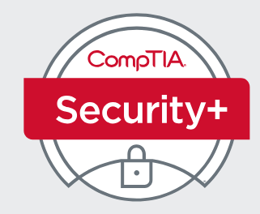

# CompTIA Security+ SY0-701 Study Platform

<p align="center">
  
</p>

<p align="center">
  
  
  
  
</p>

A comprehensive, modern, and highly interactive study platform for the **CompTIA Security+ (SY0-701)** certification exam. Built with pure HTML, CSS, and JavaScript — no build tools required. Just open `index.html` in your browser and start studying.

---

## Screenshots

<p align="center">
  
</p>

### Exam Domains

| Domain | Focus Area | Weight |
|--------|-----------|--------|
| **Part 1** | General Security Concepts | 12% |
| **Part 2** | Threats, Vulnerabilities & Mitigations | 22% |
| **Part 3** | Security Architecture | 18% |
| **Part 4** | Security Operations | 28% |
| **Part 5** | Security Program Management | 20% |

<p align="center">
  
  
  
  
  
</p>

---

## Features

### Dashboard
- Central hub with animated cards linking to all study modules
- Live statistics counters (12 exams, 90 QCM questions, 327 terms, 5 domains)
- Cyber-security / Tech noir aesthetic with dark mode by default

### Practice Tests
- **12 full practice exams** across two sets:
  - **Practice Test Set 01** (Exams 1–6)
  - **Practice Test Set 02** (Exams #1–#6)
- Each exam opens in its own interactive HTML quiz interface
- Detailed explanations and scoring included

### QCM Quiz App
- **90 interactive questions** from ExamTopics with three study modes:
  - **Quiz Mode** — Test yourself in sequence, scored at the end
  - **Study Mode** — Correct answers revealed immediately for learning
  - **Shuffle Mode** — Randomized order to simulate real exam conditions
- Keyboard navigation support (`A–F`, `←` / `→`, `Enter`)
- Confirmed vs. hidden answer indicators

### Notes & Cheatsheet
- Clean markdown viewer with sticky sidebar navigation
- 5 comprehensive domain sections with Arabic summaries
- **PDF Downloads**:
  - `Security_Plus_Notes.pdf`
  - `CompTIA-Security-Plus-SY0-701-Exam-Objectives.pdf`

### Security Dictionary
- Searchable glossary of **327+ abbreviations and terms**
- Instant filtering by abbreviation or definition
- Click any term for a detail modal popup

### Dark / Light Mode Toggle
- Switch themes instantly with the moon/sun button in the top nav
- Preference saved to `localStorage`
- Auto-detects OS `prefers-color-scheme` on first visit

---

## Project Structure

```
CompTIA Security+ (SY0-701)/
├── index.html                              # Main dashboard (SPA)
├── style.css                               # Cyber-security theme & animations
├── script.js                               # Core logic (navigation, quiz, search)
├── data_qcm.js                             # 90 QCM questions (embedded data)
├── data_terms.js                           # 327 glossary terms (embedded data)
├── data_notes.js                           # 5 domain note sections (embedded data)
├── data_qcm.json                           # QCM questions (source)
├── data_terms.json                         # Terms (source)
├── data_notes.json                         # Notes (source)
├── Practice-test-01/                       # 6 practice exams (Set 1)
│   ├── 1.1 CompTIA Security+ ... Exam 1.html
│   ├── 2.2 CompTIA Security+ ... Exam 2.html
│   ├── 3.3 CompTIA Security+ ... Exam 3.html
│   ├── 4.4 CompTIA Security+ ... Exam 4.html
│   ├── 5.5 CompTIA Security+ ... Exam 5.html
│   └── 6.6 CompTIA Security+ ... Exam 6.html
├── Practice-test-02/                       # 6 practice exams (Set 2)
│   ├── 1.1 CompTIA Security+ ... #1.html
│   ├── 2.2 CompTIA Security+ ... #2.html
│   ├── 3.3 CompTIA Security+ ... #3.html
│   ├── 4.4 CompTIA Security+ ... #4.html
│   ├── 5.5 CompTIA Security+ ... #5.html
│   └── 6.6 CompTIA Security+ ... #6.html
├── Notes-and-Cheatsheet/
│   ├── CompTIA-SecurityPlus-SY0-701-Notes-and-Cheatsheet.md
│   ├── Security_Plus_Notes.pdf
│   ├── CompTIA-Security-Plus-SY0-701-Exam-Objectives.pdf
│   ├── Terms.txt
│   └── images/
│       ├── CompTIA_SecurityPlus_SY0-701.png
│       ├── all_parts.png
│       ├── part1.png ... part5.png
└── CompTIA Security+QCM/
    └── ComptIA_Security_Plus_QCM_App.html
```

---

## Quick Start

### Option 1: Open Directly (Easiest)

Simply double-click `index.html` or open it in any modern browser:

```
# Windows
start index.html

# macOS
open index.html

# Linux
xdg-open index.html
```

The platform works **completely offline** — no internet connection required.

### Option 2: Serve with a Local Server (Recommended for Development)

```bash
# Python 3
python -m http.server 8000

# Node.js (npx)
npx serve .

# PHP
php -S localhost:8000
```

Then visit `http://localhost:8000`.

---

## Tech Stack

- **HTML5** — Semantic markup with responsive layout
- **CSS3** — Custom properties, glassmorphism, CSS Grid/Flexbox, animations, transitions
- **Vanilla JavaScript** — No frameworks, no build step, no dependencies
- **Fonts** — Inter (Google Fonts), Fira Code (monospace)

---

## Design Highlights

- **Dark mode default** with deep slates and neon cyan accents
- **Glassmorphism** navigation bar with backdrop blur
- **Ripple effects** on all interactive buttons and cards
- **Smooth fade-in animations** for card entries and view transitions
- **CSS shimmer skeletons** for loading states
- **Fully responsive** — works on mobile, tablet, and desktop

---

## Keyboard Shortcuts (QCM Quiz)

| Key | Action |
|-----|--------|
| `A` – `F` | Select answer option |
| `←` | Previous question |
| `→` or `Enter` | Next question / Finish |

---

## Browser Compatibility

| Browser | Support |
|---------|---------|
| Chrome / Edge | ✅ Full |
| Firefox | ✅ Full |
| Safari | ✅ Full |
| Opera | ✅ Full |
| Mobile Browsers | ✅ Full (responsive) |

> **Note:** This platform uses the `backdrop-filter` CSS property. For the best visual experience, use a modern browser. Older browsers will still work but may show solid backgrounds instead of frosted glass effects.

---

## License & Credits

This study platform was built as a personal learning tool for the CompTIA Security+ SY0-701 exam. All practice exam content, notes, and QCM questions are derived from publicly available study materials and the official CompTIA exam objectives.

- **CompTIA Security+** is a registered trademark of CompTIA, Inc.
- QCM questions sourced from [ExamTopics](https://www.examtopics.com/)

---

<p align="center">
  <strong>Good luck with your exam! 🛡️</strong>
</p>
